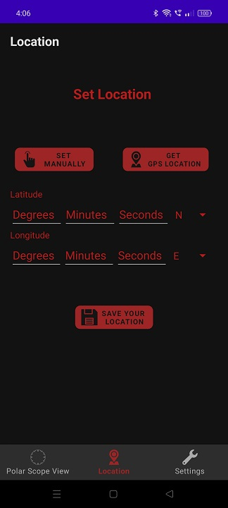
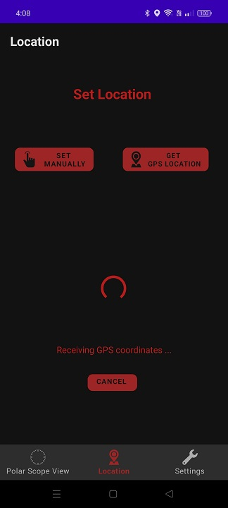
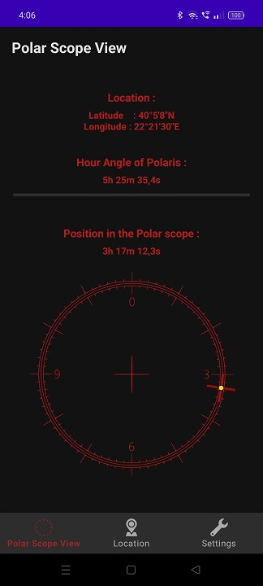
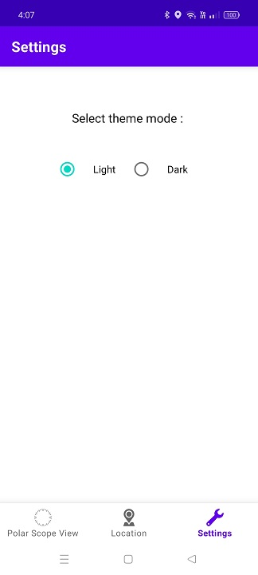
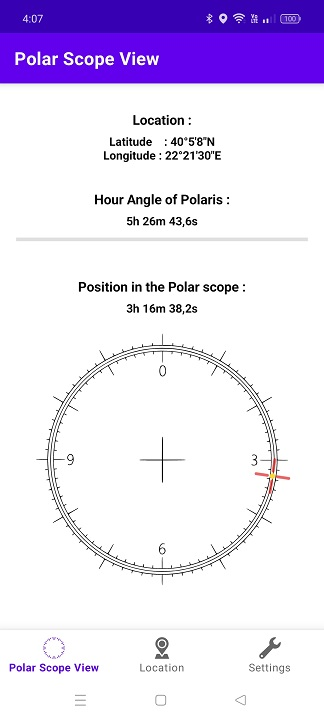
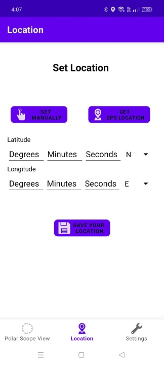

# Polar_Scope_Alignment

## An Android App For Precise Polar Alignment Of Equatorial Telescope Mounts.

### This app shows the correct position of Polaris inside the polar scope of a telescope mount.
### How to achieve polar alignment of your telescope :

1. Open the app and enter your location manually, or get the GPS coordinates of your location :

  

  
&nbsp; &nbsp; &nbsp; &nbsp;
  

2. Go to the Polar Scope View screen of the app. The current Hour Angle of Polaris and its correct position in the polar scope is calculated every second.
Polaris is indicated by a yellow dot inside the red crosshair :

  

3. Aim the mount's polar axis roughly at Polaris. At this step Polaris should be visible inside the polar scope  
4. Use the mount's azimuth and altitude adjustment screws to precisely place Polaris in the exact same spot as indicated in the Polar Scope View screen of the app. 
5. Congratulations! You now have a mount ready for astrophotography !  

Note : From the app's Settings screen you can select Dark or Light theme mode : 

  
&nbsp; &nbsp; &nbsp; &nbsp;
  
  &nbsp; &nbsp; &nbsp; &nbsp;
   

